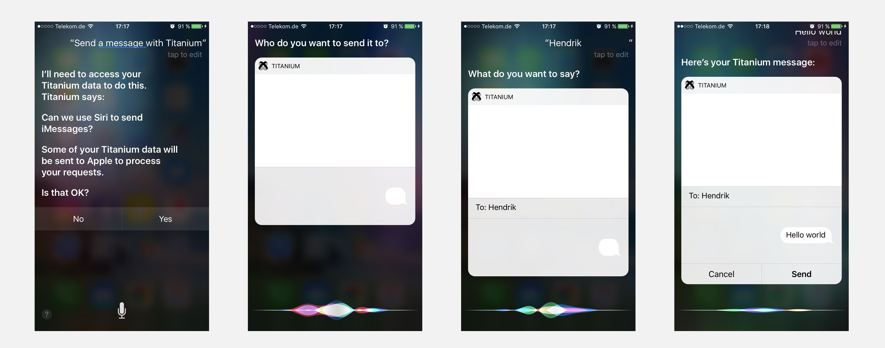

# Titanium Sample App: iOS Extensions with SiriKit

> **NOTE:** This Sample App requires Titanium >= 5.5.0 and Alloy >= 1.9.0 (part of AppC CLI >=5.5.0). It demonstrates support for iOS 10 and Xcode 8.

> **NOTE2:** This example uses a SiriKit extension, but in fact any native extension can be used the same way!

For more information on native iOS extensions with Titanium, check out the [official tutorial](https://wiki.appcelerator.org/display/guides2/Creating+iOS+Extensions%3A+Siri+Intents).

## Running the Sample

### Via Appcelerator Studio

1. Import it via *Dashboard* if available.
2. Or import it via *File > Import... > Git > Git Repository as New Project* with *URI*:

		https://github.com/appcelerator-developer-relations/ios-extensions-sample-sirikit

3. Select a Simulator or Device to build to via *Run > Run As*.

### Via CLI

1. Clone the repository:

		git clone https://github.com/appcelerator-developer-relations/ios-extensions-sample-sirikit

2. To run it with `appc run` first import it to the platform:

		appc new --import --no-services

3. Build to Simulator or Device:

		[appc run | ti build] -p ios [-T device]
